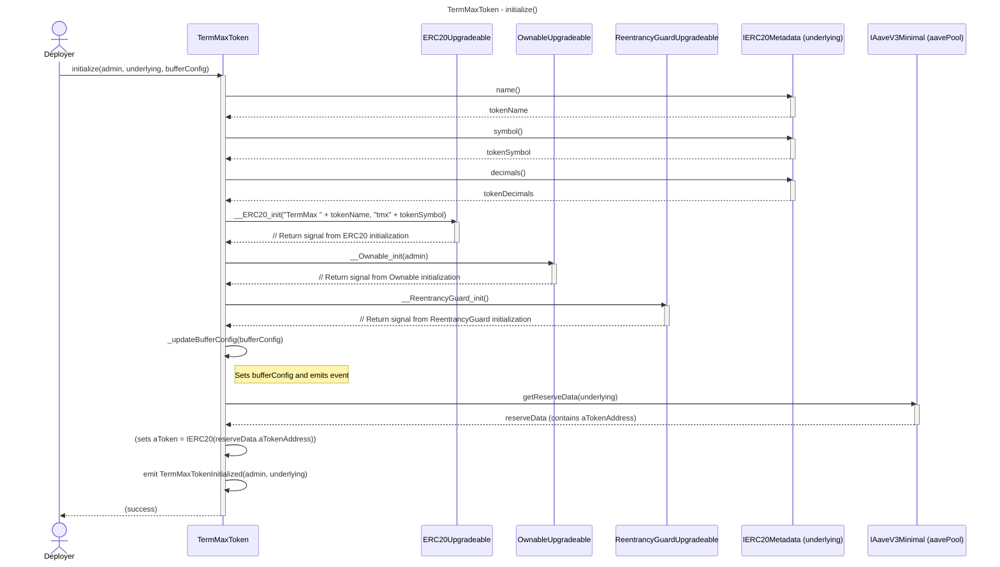

```mermaid
sequenceDiagram
    title TermMaxToken - initialize()
    actor Deployer
    participant TMT as TermMaxToken
    participant ERC20 as ERC20Upgradeable
    participant Ownable as OwnableUpgradeable
    participant ReentrancyGuard as ReentrancyGuardUpgradeable
    participant UnderlyingMeta as IERC20Metadata (underlying)
    participant AavePool as IAaveV3Minimal (aavePool)

    Deployer->>TMT: initialize(admin, underlying, bufferConfig)
    activate TMT

    TMT->>UnderlyingMeta: name()
    activate UnderlyingMeta
    UnderlyingMeta-->>TMT: tokenName
    deactivate UnderlyingMeta

    TMT->>UnderlyingMeta: symbol()
    activate UnderlyingMeta
    UnderlyingMeta-->>TMT: tokenSymbol
    deactivate UnderlyingMeta

    TMT->>UnderlyingMeta: decimals()
    activate UnderlyingMeta
    UnderlyingMeta-->>TMT: tokenDecimals
    deactivate UnderlyingMeta

    TMT->>ERC20: __ERC20_init("TermMax " + tokenName, "tmx" + tokenSymbol)
    activate ERC20
    ERC20-->>TMT: // Return signal from ERC20 initialization
    deactivate ERC20

    TMT->>Ownable: __Ownable_init(admin)
    activate Ownable
    Ownable-->>TMT: // Return signal from Ownable initialization
    deactivate Ownable

    TMT->>ReentrancyGuard: __ReentrancyGuard_init()
    activate ReentrancyGuard
    ReentrancyGuard-->>TMT: // Return signal from ReentrancyGuard initialization
    deactivate ReentrancyGuard

    TMT->>TMT: _updateBufferConfig(bufferConfig)
    Note right of TMT: Sets bufferConfig and emits event

    TMT->>AavePool: getReserveData(underlying)
    activate AavePool
    AavePool-->>TMT: reserveData (contains aTokenAddress)
    deactivate AavePool

    TMT->>TMT: (sets aToken = IERC20(reserveData.aTokenAddress))
    TMT->>TMT: emit TermMaxTokenInitialized(admin, underlying)

    TMT-->>Deployer: (success)
    deactivate TMT
```