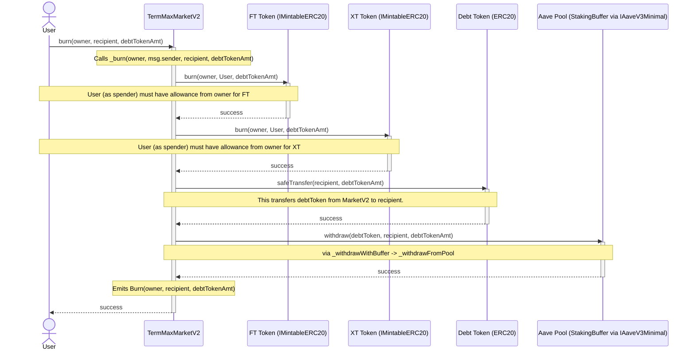

```mermaid
sequenceDiagram
    actor User
    participant MarketV2 as TermMaxMarketV2
    participant FT as FT Token (IMintableERC20)
    participant XT as XT Token (IMintableERC20)
    participant DebtToken as Debt Token (ERC20)
    participant AavePool as Aave Pool (StakingBuffer via IAaveV3Minimal)

    User->>MarketV2: burn(owner, recipient, debtTokenAmt)
    activate MarketV2

    Note over MarketV2: Calls _burn(owner, msg.sender, recipient, debtTokenAmt)

    MarketV2->>FT: burn(owner, User, debtTokenAmt)
    activate FT
    Note over FT, User: User (as spender) must have allowance from owner for FT
    FT-->>MarketV2: success
    deactivate FT

    MarketV2->>XT: burn(owner, User, debtTokenAmt)
    activate XT
    Note over XT, User: User (as spender) must have allowance from owner for XT
    XT-->>MarketV2: success
    deactivate XT

    MarketV2->>DebtToken: safeTransfer(recipient, debtTokenAmt)
    activate DebtToken
    Note over MarketV2, DebtToken: This transfers debtToken from MarketV2 to recipient.
    DebtToken-->>MarketV2: success
    deactivate DebtToken

    MarketV2->>AavePool: withdraw(debtToken, recipient, debtTokenAmt)
    activate AavePool
    Note over MarketV2,AavePool: via _withdrawWithBuffer -> _withdrawFromPool
    AavePool-->>MarketV2: success
    deactivate AavePool

    Note over MarketV2: Emits Burn(owner, recipient, debtTokenAmt)
    MarketV2-->>User: success
    deactivate MarketV2
```