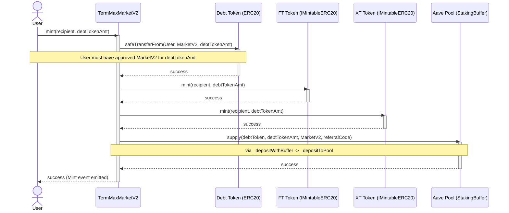

```mermaid
sequenceDiagram
    actor User
    participant MarketV2 as TermMaxMarketV2
    participant DebtToken as Debt Token (ERC20)
    participant FT as FT Token (IMintableERC20)
    participant XT as XT Token (IMintableERC20)
    participant AavePool as Aave Pool (StakingBuffer)

    User->>MarketV2: mint(recipient, debtTokenAmt)
    activate MarketV2

    MarketV2->>DebtToken: safeTransferFrom(User, MarketV2, debtTokenAmt)
    activate DebtToken
    Note over User, DebtToken: User must have approved MarketV2 for debtTokenAmt
    DebtToken-->>MarketV2: success
    deactivate DebtToken

    MarketV2->>FT: mint(recipient, debtTokenAmt)
    activate FT
    FT-->>MarketV2: success
    deactivate FT

    MarketV2->>XT: mint(recipient, debtTokenAmt)
    activate XT
    XT-->>MarketV2: success
    deactivate XT

    MarketV2->>AavePool: supply(debtToken, debtTokenAmt, MarketV2, referralCode)
    activate AavePool
    Note over MarketV2,AavePool: via _depositWithBuffer -> _depositToPool
    AavePool-->>MarketV2: success
    deactivate AavePool

    MarketV2-->>User: success (Mint event emitted)
    deactivate MarketV2
```