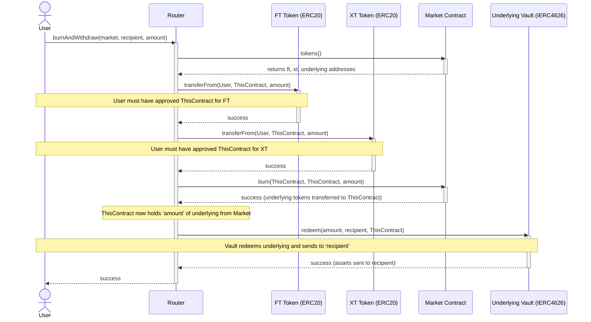

```mermaid
sequenceDiagram
    actor User
    participant ThisContract as Router
    participant FT as FT Token (ERC20)
    participant XT as XT Token (ERC20)
    participant Market as Market Contract
    participant UnderlyingVault as Underlying Vault (IERC4626)

    User->>ThisContract: burnAndWithdraw(market, recipient, amount)
    activate ThisContract
    ThisContract->>Market: tokens()
    activate Market
    Market-->>ThisContract: returns ft, xt, underlying addresses
    deactivate Market
    ThisContract->>FT: transferFrom(User, ThisContract, amount)
    activate FT
    Note over User, FT: User must have approved ThisContract for FT
    FT-->>ThisContract: success
    deactivate FT
    ThisContract->>XT: transferFrom(User, ThisContract, amount)
    activate XT
    Note over User, XT: User must have approved ThisContract for XT
    XT-->>ThisContract: success
    deactivate XT
    ThisContract->>Market: burn(ThisContract, ThisContract, amount)
    activate Market
    Market-->>ThisContract: success (underlying tokens transferred to ThisContract)
    deactivate Market
    Note over ThisContract: ThisContract now holds 'amount' of underlying from Market
    ThisContract->>UnderlyingVault: redeem(amount, recipient, ThisContract)
    activate UnderlyingVault
    Note over UnderlyingVault, User: Vault redeems underlying and sends to 'recipient'
    UnderlyingVault-->>ThisContract: success (assets sent to recipient)
    deactivate UnderlyingVault
    ThisContract-->>User: success
    deactivate ThisContract
```