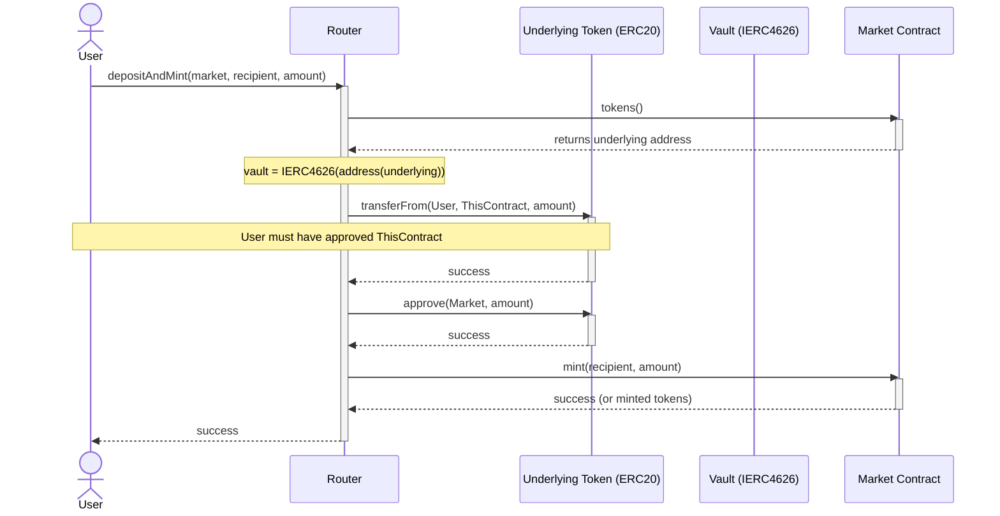

```mermaid
sequenceDiagram
    actor User
    participant ThisContract as Router
    participant UnderlyingToken as Underlying Token (ERC20)
    participant Vault as Vault (IERC4626)
    participant Market as Market Contract

    User->>ThisContract: depositAndMint(market, recipient, amount)
    activate ThisContract
    ThisContract->>Market: tokens()
    activate Market
    Market-->>ThisContract: returns underlying address
    deactivate Market
    Note over ThisContract: vault = IERC4626(address(underlying))
    ThisContract->>UnderlyingToken: transferFrom(User, ThisContract, amount)
    activate UnderlyingToken
    Note over User, UnderlyingToken: User must have approved ThisContract
    UnderlyingToken-->>ThisContract: success
    deactivate UnderlyingToken
    ThisContract->>UnderlyingToken: approve(Market, amount)
    activate UnderlyingToken
    UnderlyingToken-->>ThisContract: success
    deactivate UnderlyingToken
    ThisContract->>Market: mint(recipient, amount)
    activate Market
    Market-->>ThisContract: success (or minted tokens)
    deactivate Market
    ThisContract-->>User: success
    deactivate ThisContract
```